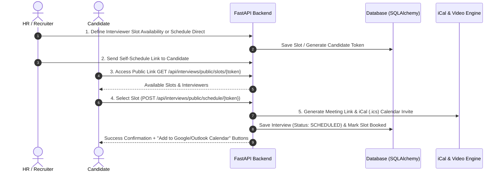

# 📅 Automated Interview Scheduling (P0) — Feature Specification & Implementation Plan

---

## 1. Executive Summary & Objectives

The **Automated Interview Scheduling** module delivers end-to-end management for technical and HR candidate interviews. It bridges internal interviewer availability with self-scheduling candidate access, automated video link generation, and bi-directional calendar invitations (`.ics` iCal / Google Calendar).

### Key Deliverables:
1. **Candidate Self-Scheduling Portal**: A tokenized public page (`/interview/schedule/:token`) where candidates select from available interviewer time slots.
2. **Instant Video Meeting Link Generation**: Automatic Google Meet link creation with seamless Jitsi fallback (`https://meet.jit.si/AIRecruiter-...`), with click-to-join and copy meeting link controls.
3. **Calendar Sync & iCal (`.ics`) Invite Generator**: Downloadable and emailable `.ics` calendar invitation payloads allowing 1-click import into Google Calendar, Apple Calendar, and Outlook.
4. **Interactive Dashboard Calendar View (`InterviewsTab.jsx`)**: Month / Week / Day agenda calendar view showing scheduled interviews, interviewer availability, quick join buttons, and slot management.

---

## 2. System Architecture & End-to-End Flow



---

## 3. Database Schema Design (`backend/app/models/interview.py`)

```python
class InterviewSlot(Base, BaseModelMixin):
    __tablename__ = "interview_slots"

    id: Mapped[int] = mapped_column(primary_key=True, index=True)
    interviewer_id: Mapped[int] = mapped_column(
        ForeignKey("users.id", ondelete="CASCADE"),
        nullable=False,
        index=True,
    )
    job_id: Mapped[Optional[int]] = mapped_column(
        ForeignKey("jobs.id", ondelete="CASCADE"),
        nullable=True,
        index=True,
    )
    slot_date: Mapped[date] = mapped_column(Date, nullable=False, index=True)
    start_time: Mapped[time] = mapped_column(Time, nullable=False)
    end_time: Mapped[time] = mapped_column(Time, nullable=False)
    is_booked: Mapped[bool] = mapped_column(Boolean, default=False, index=True)
    created_at: Mapped[datetime] = mapped_column(DateTime, server_default=func.now())


class Interview(Base, BaseModelMixin):
    __tablename__ = "interviews"

    id: Mapped[int] = mapped_column(primary_key=True, index=True)
    application_id: Mapped[int] = mapped_column(
        ForeignKey("applications.id", ondelete="CASCADE"),
        nullable=False,
        index=True,
    )
    candidate_id: Mapped[int] = mapped_column(
        ForeignKey("candidates.id", ondelete="CASCADE"),
        nullable=False,
        index=True,
    )
    job_id: Mapped[int] = mapped_column(
        ForeignKey("jobs.id", ondelete="CASCADE"),
        nullable=False,
        index=True,
    )

    scheduled_date: Mapped[date] = mapped_column(Date, nullable=False, index=True)
    scheduled_time: Mapped[time] = mapped_column(Time, nullable=False)
    duration_minutes: Mapped[int] = mapped_column(Integer, default=45)

    meeting_type: Mapped[str] = mapped_column(String, default="GOOGLE_MEET")  # GOOGLE_MEET | JITSI | IN_PERSON
    meeting_link: Mapped[str] = mapped_column(String, nullable=False)

    interviewer_1: Mapped[str] = mapped_column(String, nullable=False)
    interviewer_2: Mapped[Optional[str]] = mapped_column(String, nullable=True)

    # Candidate Self-Scheduling Token
    self_schedule_token: Mapped[Optional[str]] = mapped_column(String, unique=True, index=True, nullable=True)
    token_expires_at: Mapped[Optional[datetime]] = mapped_column(DateTime, nullable=True)

    # Status: SCHEDULED | COMPLETED | CANCELLED | RESCHEDULED
    status: Mapped[str] = mapped_column(String, default="SCHEDULED", index=True, nullable=False)
    notes: Mapped[Optional[str]] = mapped_column(Text, nullable=True)

    created_at: Mapped[datetime] = mapped_column(DateTime, server_default=func.now())
    updated_at: Mapped[datetime] = mapped_column(DateTime, server_default=func.now(), onupdate=func.now())
```

---

## 4. API Endpoints Specification

### Internal Executive & HR APIs (`/api/interviews`)
| Method | Endpoint | Description | Auth |
| :--- | :--- | :--- | :--- |
| `POST` | `/api/interviews` | Schedule interview directly & generate meeting link | HR / CEO |
| `GET` | `/api/interviews` | List interviews (supports date range & status filters) | HR / CEO |
| `GET` | `/api/interviews/{id}` | Detailed interview view + feedback history | HR / CEO |
| `POST` | `/api/interviews/slots` | Create interviewer availability slots | HR / CEO |
| `GET` | `/api/interviews/slots` | List available slots | HR / CEO |
| `POST` | `/api/interviews/{id}/reschedule` | Reschedule interview date/time | HR / CEO |
| `POST` | `/api/interviews/{id}/self-schedule-link` | Generate 7-day self-schedule token for candidate | HR / CEO |
| `GET` | `/api/interviews/{id}/ical` | Download standard `.ics` calendar invite file | Public / Auth |

### Candidate Public Self-Scheduling APIs (`/api/interviews/public`)
| Method | Endpoint | Description | Auth |
| :--- | :--- | :--- | :--- |
| `GET` | `/api/interviews/public/slots/{token}` | Validate token & fetch available slots | Public Token |
| `POST` | `/api/interviews/public/schedule/{token}` | Candidate selects slot & confirms booking | Public Token |

---

## 5. Video Link & iCal Calendar Sync Mechanics

1. **Video Link Generation Utility (`utils/meeting_generator.py`)**:
   - Primary: Google Calendar API integration.
   - Fallback: Auto-generated unique Jitsi room link (`https://meet.jit.si/AIRecruiter-{uuid}`).
2. **iCal (`.ics`) Calendar Invite Generator (`utils/ical_generator.py`)**:
   - Generates RFC 5545 compliant `.ics` text string.
   - Includes `SUMMARY`, `LOCATION` (Meeting Link), `DESCRIPTION`, `START`, `END`, and `ATTENDEES`.
   - Candidate & Interviewer can click "Add to Google Calendar" or download `.ics` file.

---

## 6. Frontend UI Components (React + Vite)

### A. Dashboard Calendar & Video Hub (`frontend/src/components/ceo/InterviewsTab.jsx`)
- **View Switcher**: Toggle between **Month Calendar View**, **Weekly Grid**, and **Chronological Agenda**.
- **Meeting Controls**: Direct **"Join Video Call"** button, copy link button, and instant `.ics` download button.
- **Availability Slot Manager Drawer**: UI to define interviewer available days and time windows.
- **Candidate Self-Schedule Drawer**: Generate and copy self-schedule candidate link.

### B. Candidate Self-Scheduling Portal (`frontend/src/components/pages/CandidateSelfSchedulePage.jsx`)
- Route: `/interview/schedule/:token`.
- Date carousel picker and interactive time slot chips (`10:00 AM`, `02:30 PM`).
- Automatic timezone detection (`Asia/Karachi (GMT+5)`).
- Post-booking confirmation screen with **"Add to Google Calendar"** and **"Download .ics"** buttons.

---

## 7. Implementation Milestones

- [ ] **Phase 1**: Backend SQLAlchemy models (`interview.py`), Pydantic schemas, meeting generator & `.ics` iCal utilities.
- [ ] **Phase 2**: Backend API routes (Direct scheduling, slot management, candidate self-schedule APIs).
- [ ] **Phase 3**: Enhanced `InterviewsTab.jsx` with interactive calendar view & video call controls.
- [ ] **Phase 4**: Candidate Public Self-Scheduling Portal (`CandidateSelfSchedulePage.jsx`).
- [ ] **Phase 5**: Verification & End-to-End Calendar Testing.
