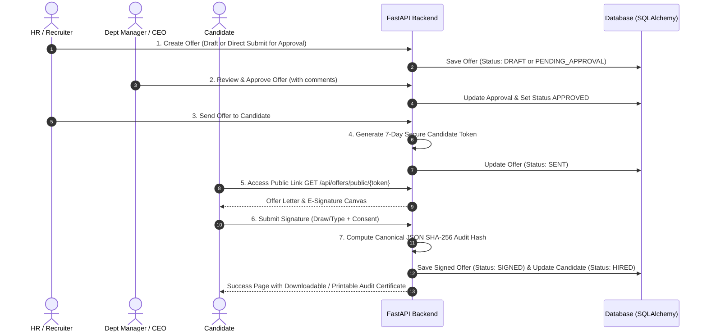

# 📄 Offer Management, Approvals, and Electronic Signature

```mermaid
sequenceDiagram
    autonumber
    actor HR as HR / Recruiter
    actor Manager as Dept Manager / CEO
    actor Candidate as Candidate
    participant BE as FastAPI Backend
    participant DB as Database (SQLAlchemy)

    HR->>BE: 1. Create Offer (Draft or Direct Submit for Approval)
    BE->>DB: Save Offer (Status: DRAFT or PENDING_APPROVAL)
    Manager->>BE: 2. Review & Approve Offer (with comments)
    BE->>DB: Update Approval & Set Status APPROVED
    HR->>BE: 3. Send Offer to Candidate
    BE->>BE: 4. Generate 7-Day Secure Candidate Token
    BE->>DB: Update Offer (Status: SENT)
    Candidate->>BE: 5. Access Public Link GET /api/offers/public/{token}
    BE-->>Candidate: Offer Letter & E-Signature Canvas
    Candidate->>BE: 6. Submit Signature (Draw/Type + Consent)
    BE->>BE: 7. Compute Canonical JSON SHA-256 Audit Hash
    BE->>DB: Save Signed Offer (Status: SIGNED) & Update Candidate (Status: HIRED)
    BE-->>Candidate: Success Page with Downloadable / Printable Audit Certificate
```
