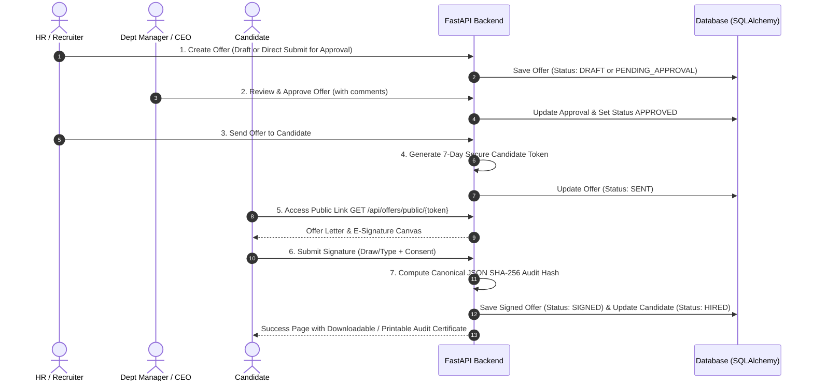
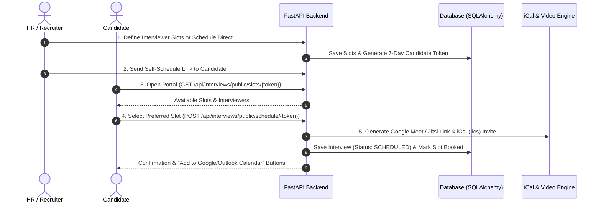

# 📄 AI Recruiter System Specifications

---

## 1. Offer Management, Approvals, and Electronic Signature

### Critical Decisions
- Used explicit `"GLOBAL"` sentinel value for `OfferTemplate.department` to enable B-tree index seeks without performance-degrading `OR IS NULL` SQL table scans.

### File Changes

**Modified:**
- `backend/app/database.py`: Added `BaseModelMixin` (`from_dict()` & `update_from_dict()`) to automate dictionary payload mapping onto SQLAlchemy models.
- `backend/app/config.py`: Centralized environment variable parsing (`python-dotenv`) for dynamic database URLs and security settings.
- `frontend/src/components/ceo/Dashboard.jsx`: Integrated `Offer Letters` tab and navigation item into CEO dashboard.

**Created:**
- `backend/app/models/offer.py`
- `backend/app/schemas/offer.py`
- `backend/app/utils/offer_crypto.py`
- `backend/app/routes/offer.py`
- `frontend/src/components/ceo/OfferManagementTab.jsx`
- `frontend/src/components/pages/CandidateOfferSignPage.jsx`

---

## 2. Automated Interview Scheduling (P0)

### Critical Decisions
- Used numeric `0` sentinel value for `InterviewSlot.job_id` to represent universal interviewer availability across all job postings.

### File Changes

**Modified:**
- `frontend/src/components/ceo/InterviewsTab.jsx`: Added Agenda vs Slots view switcher, direct Join Call launcher, `.ics` calendar downloader, slot builder modal, and self-schedule link generator.

**Created:**
- `backend/app/models/interview.py`
- `backend/app/schemas/interview.py`
- `backend/app/utils/meeting_generator.py`
- `backend/app/utils/ical_generator.py`
- `backend/app/utils/interview_crypto.py`
- `backend/app/routes/interview.py`
- `frontend/src/components/pages/CandidateSelfSchedulePage.jsx`

---

## 3. Core Application Entrypoints

**Modified:**
- `backend/app/main.py`: Registers new SQLAlchemy model metadata for automatic table creation on startup (`metadata.create_all`) and includes feature API routers into the main FastAPI application.
- `frontend/src/App.jsx`: Registers new public and protected React Router paths (e.g., `/offer/sign/:token` and `/interview/schedule/:token`) to render client-facing web pages.
