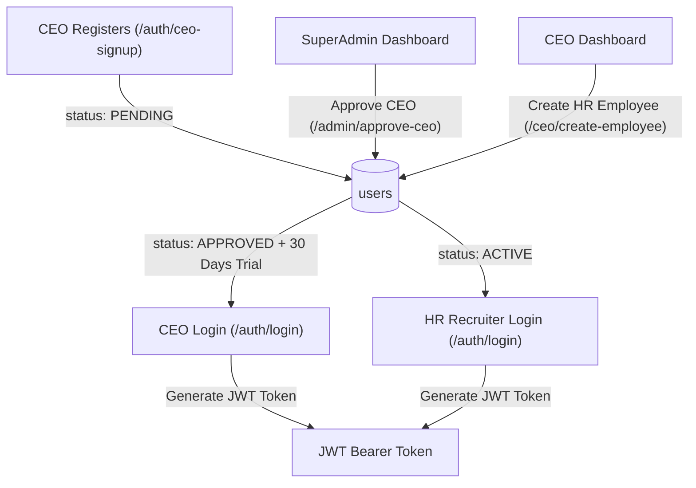
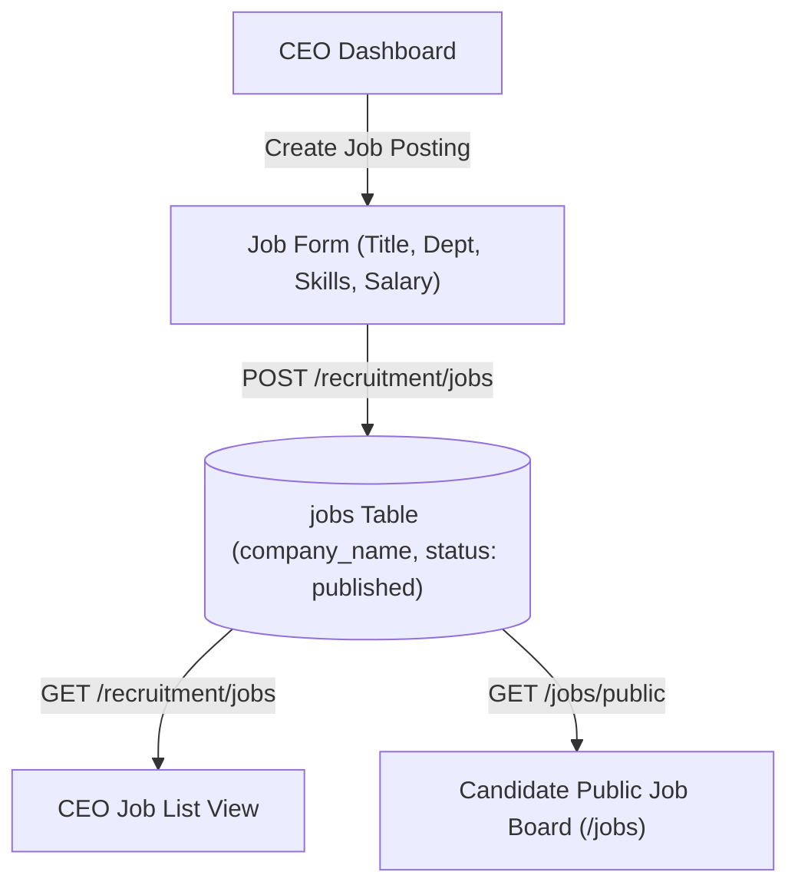
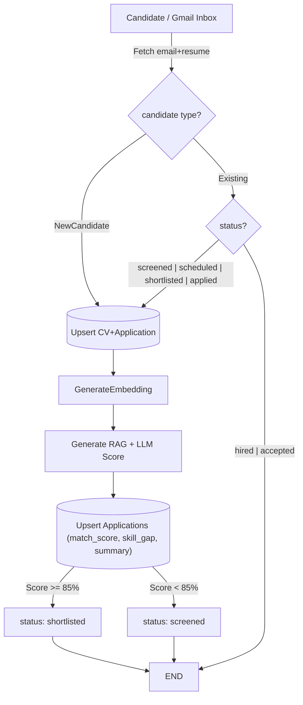
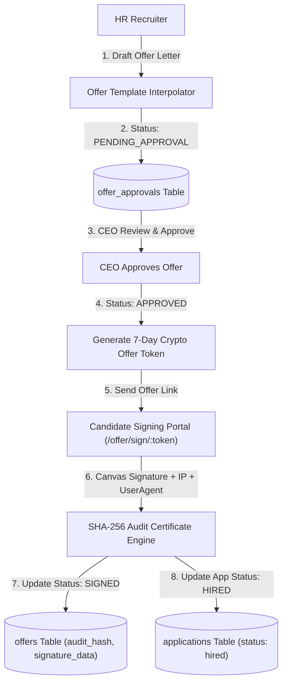

Here is the complete project documentation split **feature by feature**, with each feature grouped inside its own standalone ```mermaid``` code block for easy copy-pasting into markdown files:

---

### Feature 1: Authentication & User Management (RBAC)



---

### Feature 2: Job Management & Publishing



---

### Feature 3: AI Resume Screening & Parsing (Gmail Sync, Embeddings & LLM)



---

### Feature 4: Automated Interview Scheduling & Candidate Self-Scheduling Portal

```mermaid
flowchart TD
    Interviewer["HR / CEO Dashboard"] -->|Create Time Slots| DB_Slots[("interview_slots Table")]
    Interviewer -->|Generate Candidate Self-Schedule Link| TokenGen["7-Day Crypto Token Generator"]
    TokenGen -->|POST /interviews/{id}/self-schedule-link| CandPortal["Candidate Portal (/interview/schedule/:token)"]
    CandPortal -->|Select Slot & Confirm| SlotLock["Lock Slot (is_booked: True)"]
    SlotLock --> VideoGen["Meeting Generator (Google Meet / Jitsi Fallback)"]
    VideoGen -->|Save Interview Record| DB_Interviews[("interviews_v2 Table")]
    VideoGen --> iCalGen["RFC 5545 .ics Calendar Generator"]
    iCalGen -->|Download .ics File| CandPortal
```

---

### Feature 5: Interview Evaluation & AI Candidate Ranking Leaderboard

```mermaid
flowchart TD
    Interviewer["HR / Interviewer"] -->|Submit Interview Scorecard| FeedbackRoute["POST /recruitment/submit-feedback"]
    FeedbackRoute --> EvalEngine["Evaluation Agent Engine"]
    EvalEngine -->|Resume Score (40%) + Technical (40%) + Communication (20%)| Formula["Final Score Formula"]
    Formula --> Category["Assign Category (Strong Hire | Hire | Consider | Reject)"]
    Category --> DB_Scores[("final_scores Table")]
    DB_Scores -->|GET /recruitment/ranked-candidates/{job_id}| CEO_Leaderboard["CEO Ranked Candidate Leaderboard"]
```

---

### Feature 6: Offer Letter Management, Approval Queue & E-Signature Audit Certificate

